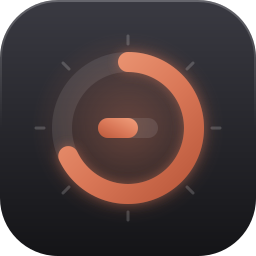
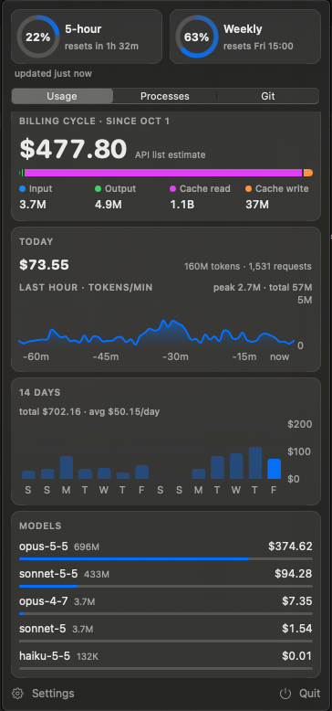

<p align="center">
  
</p>

<h1 align="center">Claude Usage Bar</h1>

<p align="center">
  <b>Never get surprised by a Claude Code rate limit again.</b><br>
  Your 5-hour and Weekly limits, spend and sessions, one glance away in the macOS menu bar.
</p>

<p align="center">
  
  
  
  
</p>

<p align="center">
  <a href="#install"><b>Install in one line</b></a> ·
  <a href="#about-the-numbers">How accurate is it?</a> ·
  <a href="#privacy">Privacy</a>
</p>

<p align="center">
  
</p>

## Why you'll like it

- ⏱️ **See your limits before you hit them.** A mini gauge for the 5-hour or Weekly window sits in the menu bar with the time until it resets. Turn on notifications to get a nudge as you approach a limit.
- 💸 **Know what your usage is worth.** You get cost for the billing cycle and for today, a token breakdown (input, output, cache read, cache write), and spend per model such as Opus, Sonnet and Haiku.
- 📈 **Spot the busy hours and heavy days.** A live tokens-per-minute chart covers the last hour and a cost chart covers 14 days. Hover either one for exact numbers.
- 🧹 **Rein in runaway sessions.** Every running Claude Code session is listed with its CPU, memory and uptime, plus a button to stop it.
- 🌿 **Keep an eye on your repos.** The Git tab shows the status of every repo Claude Code has been working in.
- 🔒 **Private by design.** Everything runs on your Mac. The only network call fetches the price table from LiteLLM's public file on GitHub, once every 24 hours.

## Install

Paste this into Terminal. It installs the latest release to `/Applications` and opens it; run it again to update.

```sh
curl -fsSL https://raw.githubusercontent.com/ghostza1209/ClaudeUsageBar/HEAD/install.sh | sh
```

Requires macOS 15 or later; the build is universal (Apple silicon and Intel).

<details>
<summary>Manual install from the zip</summary>

1. Download `ClaudeUsageBar.zip` from the [Releases](https://github.com/ghostza1209/ClaudeUsageBar/releases) page, unzip it and move `ClaudeUsageBar.app` to `/Applications`.
2. The app is ad-hoc signed, not notarized, so macOS blocks the first launch. Either right-click the app, choose **Open**, then **Open** again; or, if that is not offered, open System Settings › Privacy & Security and press **Open Anyway**; or run `xattr -cr /Applications/ClaudeUsageBar.app` once.

</details>

## One setup step for Plan limits

Claude Code only exposes your 5-hour and Weekly limits to its statusline. In the popover, press **Install…** (or Settings › Statusline › Install). This points `statusLine.command` in `~/.claude/settings.json` at a small wrapper that saves the limits and then runs your previous statusline unchanged. **Uninstall** restores the previous setting. Without it the gauge shows `⚠`.

## About the numbers

| Number | Where it comes from | How far to trust it |
|---|---|---|
| 5-hour / Weekly % | Claude Code's own `rate_limits`, as reported by Anthropic | The official figure. It refreshes whenever Claude Code runs its statusline, and turns orange when it is over 10 minutes old. |
| Dollar amounts | Your token counts × API list prices | An **estimate**, not what you pay on a Pro/Max plan. Cross-checked against [ccusage](https://github.com/ryoppippi/ccusage) to within about 0.1%; both use the same LiteLLM prices. |
| Tokens | `~/.claude/projects/**/*.jsonl` on this Mac | Cache reads dominate the total, so it reads much larger than the tokens you "typed". Other machines and claude.ai are not counted. |

Models with no known price (and `fast` speed responses) count as $0, so the estimate can run low; the model table flags them.

## Privacy

It reads `~/.claude/projects/**/*.jsonl` and `~/.claude/sessions/`, and nothing is sent anywhere.

## Build from source

```sh
sh scripts/bundle.sh     # build, sign, open
sh scripts/package.sh    # universal build, zipped to dist/ClaudeUsageBar.zip
swift test
```

The app is a Swift Package with no Xcode project; see [the ADR](docs/adr/0001-swiftpm-only-with-bundle-script.md) for why. Domain terms (Plan limits, API list estimate, Billing cycle) are defined in [GLOSSARY.md](GLOSSARY.md).
